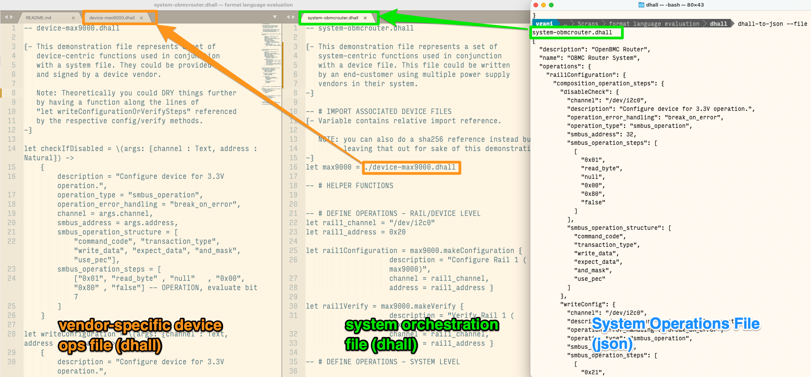

#README
------------------------------------------------------

## Install and try Instructions

The demonstration files can be parsed by:

   - Installing the dhall tools for generating JSON or YAML:
     https://docs.dhall-lang.org/tutorials/Getting-started_Generate-JSON-or-YAML.html

   - Opening your terminal to the containing folder.
     (i.e. "....../format language evaluation/dhall")

   - running dhall-to-json on the system file.
     (i.e.  `dhall-to-json --file system-obmcrouter.dhall` )
     Output by default printed,  pair your shell-specific 
     pipe operation to direct to a file.

